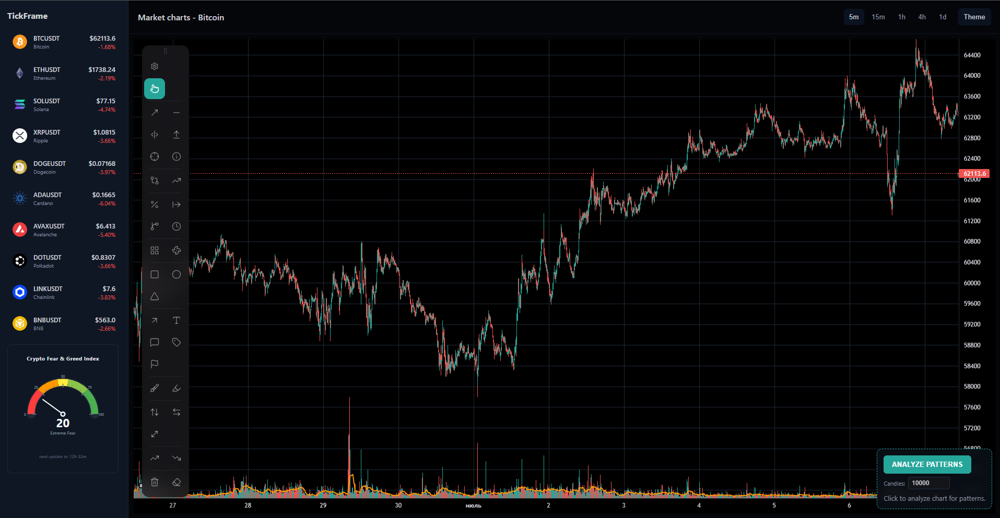
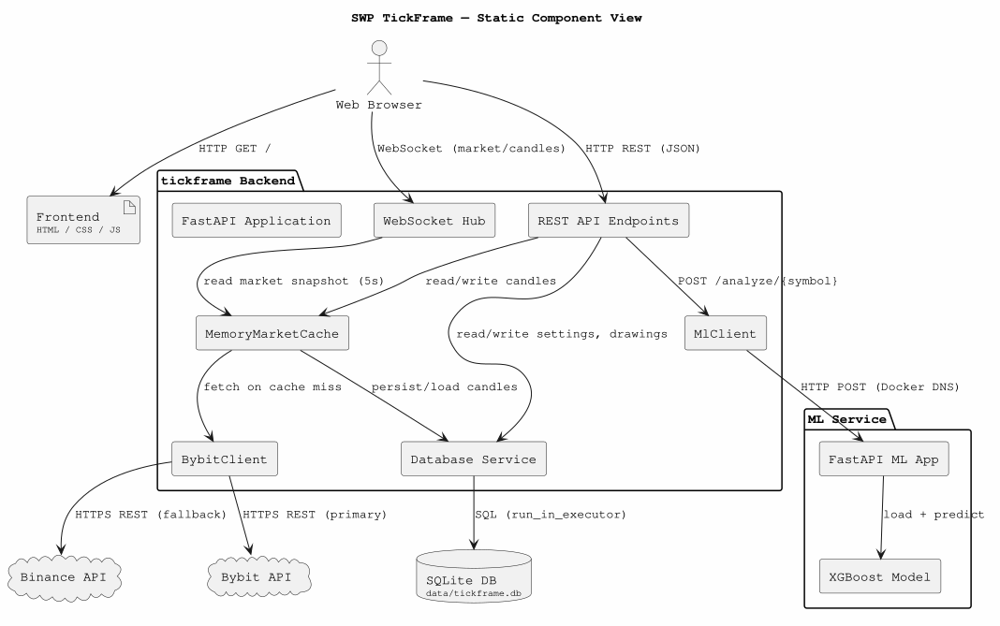

# SWP TickFrame — Team 28

FastAPI-based cryptocurrency chart workstation with real-time Bybit market data, live price streaming via WebSockets, candlestick charts (Lightweight Charts v5), a canvas-based drawing toolbar (13 tools), SQLite persistence, and ML pattern analysis.



---

## Quick Links

| | |
|---|---|
| 🚀 **Product Access** | http://10.93.26.164:8080/ |
| 📖 **Hosted Documentation** | https://Fedos113.github.io/SWP_TickFrame_28_team/ |
| 📋 **Customer Handover** | [docs/customer-handover.md](docs/customer-handover.md) |
| 🤝 **Contributing Guide** | [CONTRIBUTING.md](CONTRIBUTING.md) |
| 🤖 **AI Agent Context** | [AGENTS.md](AGENTS.md) |

---

**Latest Release:** [v2.0.0](https://github.com/Fedos113/SWP_TickFrame_28_team/releases/tag/v2.0.0) (MVP v2)

---

## Quick Start (Docker)

### Prerequisites

- [Docker](https://docs.docker.com/get-docker/) + Docker Compose
- 2 CPU cores, 2 GB RAM recommended

### 1. Clone

```bash
git clone https://github.com/Fedos113/SWP_TickFrame_28_team.git
cd SWP_TickFrame_28_team
```

### 2. Check for port conflicts

Other applications (e.g. VS Code extensions, dev servers) may already be listening on port `8000`. Check with:

```bash
netstat -ano | findstr ":8000"
```

If you see a non-Docker process on port `8000`, the Docker container will be unreachable on that port. The docker-compose.yml maps `8080:8000` to avoid the most common conflict — adjust the host port in `docker-compose.yml` if needed.

### 3. Build and run

```bash
docker compose up --build
```

### 4. Open in browser

```
http://localhost:8080
```

For a remote VM, replace `localhost` with the VM's IP address.

> The first load may take 10–30 seconds while historical candle data is fetched from the exchange. Once cached in SQLite, subsequent loads are instant.

---

### Full Docker rebuild guide

If file changes aren't reflected after `--build`, Docker may be using cached layers. Steps for a guaranteed clean deployment:

```bash
# 1. Stop and remove all containers + network
docker compose down

# 2. (Optional) Remove old images to reclaim space
docker compose rm

# 3. Rebuild from scratch (ignores ALL cache layers)
docker compose build --no-cache

# 4. Start containers in detached mode
docker compose up -d

# 5. Verify both services are healthy
curl http://localhost:8080/api/health
curl http://localhost:8001/health

# Expected output:
# {"status":"ok"}
# {"status":"success","model_loaded":true}
```

**Why `--no-cache` is required:** Docker's `COPY . .` step caches the build context. Even when source files change, `docker compose up --build` reuses the cached layer unless `--no-cache` is explicitly passed.

**Port conflicts:** The host port in `docker-compose.yml` (`8080:8000`) is the only port you should use on your host machine. The container's internal port `8000` is only reachable from inside the Docker network. A host process on port `8000` (e.g., VS Code, Python dev server) will silently intercept traffic before Docker, even when Docker is running — use a different host port or stop the conflicting process.

---

## Local Development (No Docker)

For development or debugging without Docker:

### 1. Clone and setup

```bash
git clone https://github.com/Fedos113/SWP_TickFrame_28_team.git
cd SWP_TickFrame_28_team
```

### 2. Create virtual environment

```bash
python -m venv .venv
.venv\Scripts\Activate.ps1   # Windows
# source .venv/bin/activate  # Linux/macOS
```

### 3. Install dependencies

```bash
pip install -r requirements.txt
pip install -r tests/requirements.txt
```

### 4. Start backend server

```bash
uvicorn tickframe.backend.main:app --host 0.0.0.0 --port 8000
```

### 5. Open in browser

```
http://localhost:8000
```

> Note: ML service must be started separately for pattern analysis to work.

---

## Architecture



### Project structure

```
tickframe/
├── backend/           # FastAPI app, API endpoints, services, models
├── frontend/          # HTML, CSS, JS (Lightweight Charts v5, drawing toolbar)
├── ml_service/        # ML pattern detection microservice
├── data/tickframe.db  # SQLite database (auto-created, gitignored)
├── docker-compose.yml # tickframe + ml-service containers
└── requirements.txt
```

See [full architecture docs](docs/architecture/README.md) for component, sequence, and deployment diagrams.

### Data flow

```
Exchange (Bybit/Binance)
    ↓  (paginated fetch, max 50k candles)
MemoryMarketCache (in-memory, 5s refresh)
    ↓  (merge + dedup)
SQLite (data/tickframe.db) ← survives restarts
    ↓
Frontend chart (Lightweight Charts v4, last 10k candles default zoom)
    ↓  (sliding window, step 10)
ML service → pattern detections rendered as vertical lines + text labels
```

---

## Features

| Feature | Detail |
|---|---|
| **Chart** | Lightweight Charts v4, up to 50k candles, candlestick/line/area modes |
| **Drawing tools** | 13 tools: Trend Line, H-Line, V-Line, Ray, Cross Line, Fibonacci, Price Range %, Rectangle, Circle, Arrow, Text, Brush, Redact (select/move/edit) |
| **Per-drawing settings** | Color, width (1–4), line style (solid/dashed/dotted), font size |
| **Redact mode** | Freezes chart (no scroll/zoom), crosshair hidden, enables drag-to-move/reshape |
| **Undo** | Full undo stack for add, modify (drag), and delete operations |
| **Persistence** | All drawings saved per coin to SQLite; candle data cached in DB across restarts |
| **Real-time updates** | WebSocket streams with heartbeat (5s), candle updates pushed to chart |
| **Pattern analysis** | Sliding window (50 candles, step 10) sends to ML service; results rendered as red dashed vertical lines + labels |
| **Theme** | Dark/light toggle, persisted to DB |
| **Coin sidebar** | Full ticker badges, trend-colored prices (5m candle direction), 5s auto-refresh |
| **Price formatting** | Max 6 total digits, trailing zeros stripped |

---

## API Endpoints

| Method | Path | Description |
|---|---|---|
| GET | `/api/health` | Health check |
| GET | `/api/coins` | List coins with prices and trend |
| GET | `/api/coins/{symbol}/price` | Current price |
| GET | `/api/coins/{symbol}/candles?interval=5m&limit=200` | Candlestick data (max 50000) |
| POST | `/api/analyze/{symbol}` | Pattern analysis (optional `{candles: [...]}` body) |
| GET | `/api/drawings?symbol=` | Load persisted drawings per coin |
| POST | `/api/drawings` | Save drawings per coin |
| GET | `/api/settings` | Load settings from DB |
| POST | `/api/settings` | Save settings to DB |
| WS | `/ws/market` | Market snapshot stream (5s) |
| WS | `/ws/candles/{symbol}?interval=5m` | Candle stream with heartbeat |

---

## Configuration

Bybit public endpoints work without authentication. For higher rate limits, create `.env`:

```bash
cp .env.example .env
```

Key variables:

| Variable | Default | Description |
|---|---|---|
| `ML_API_URL` | `http://ml-service:8001/predict` | ML analysis endpoint |
| `ML_CONFIDENCE_THRESHOLD` | `0.80` | Default confidence threshold |
| `ML_REQUEST_TIMEOUT` | `30.0` | ML request timeout (seconds) |

---

## Troubleshooting

| Symptom | Likely cause | Fix |
|---|---|---|
| `docker compose up` fails on port | Port `8000` or `8080` already in use | `netstat -ano \| findstr ":8080"` → stop conflicting process or change host port in `docker-compose.yml` |
| UI loads but no candles | Exchange API rate limit or network blocked | Wait 30 s and refresh; verify outbound HTTPS to `api.bybit.com` |
| WebSocket disconnects | Network timeout after 30 s idle | Auto-reconnect is built in — wait a few seconds |
| ML analysis returns empty | ML service not running | `curl http://localhost:8001/health`; if down, `docker compose restart ml-service` |
| Drawings not saving | SQLite file permissions | Ensure `data/` directory is writable by the container (uid 1000) |
| Charts show "No data" | Interval changed before candle fetch completed | Refresh the page |

For persistent issues, file a [GitHub issue](https://github.com/Fedos113/SWP_TickFrame_28_team/issues).

---

## Documentation & Reports

| Resource | Link |
|---|---|
| Customer Handover | [docs/customer-handover.md](docs/customer-handover.md) |
| Contributing Guide | [CONTRIBUTING.md](CONTRIBUTING.md) |
| AI Agent Context | [AGENTS.md](AGENTS.md) |
| Architecture Docs | [docs/architecture/README.md](docs/architecture/README.md) |
| Roadmap | [docs/roadmap.md](docs/roadmap.md) |
| Changelog | [CHANGELOG.md](CHANGELOG.md) |
| Definition of Done | [docs/definition-of-done.md](docs/definition-of-done.md) |
| Testing Strategy | [docs/testing.md](docs/testing.md) |
| Sprint Reports | [reports/](reports/) |
