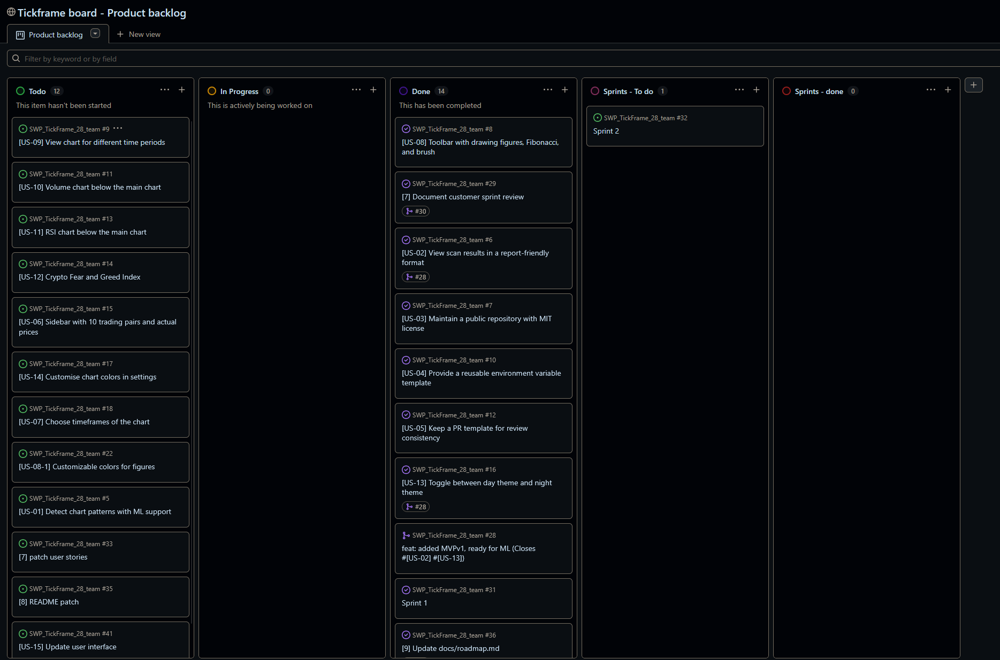
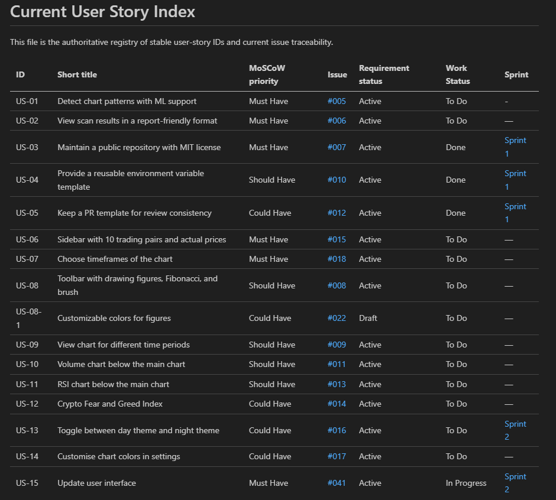
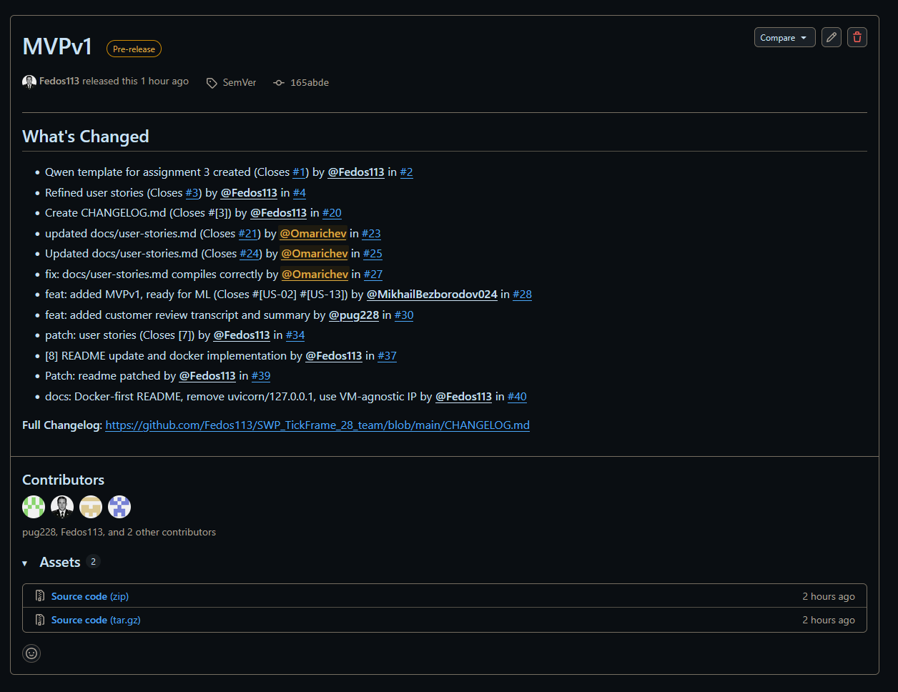
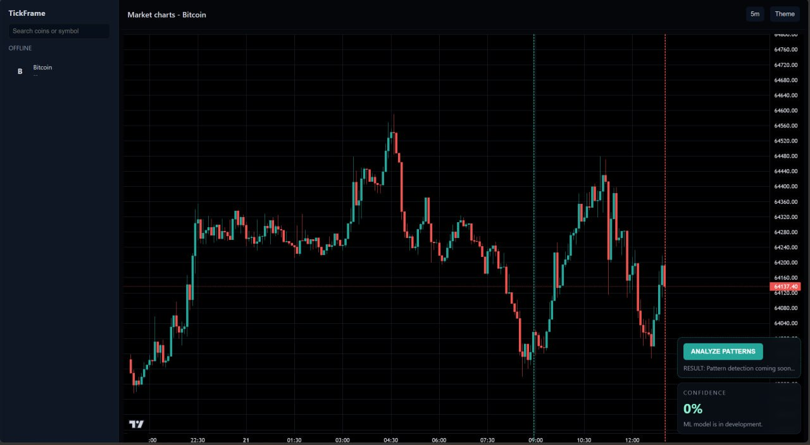
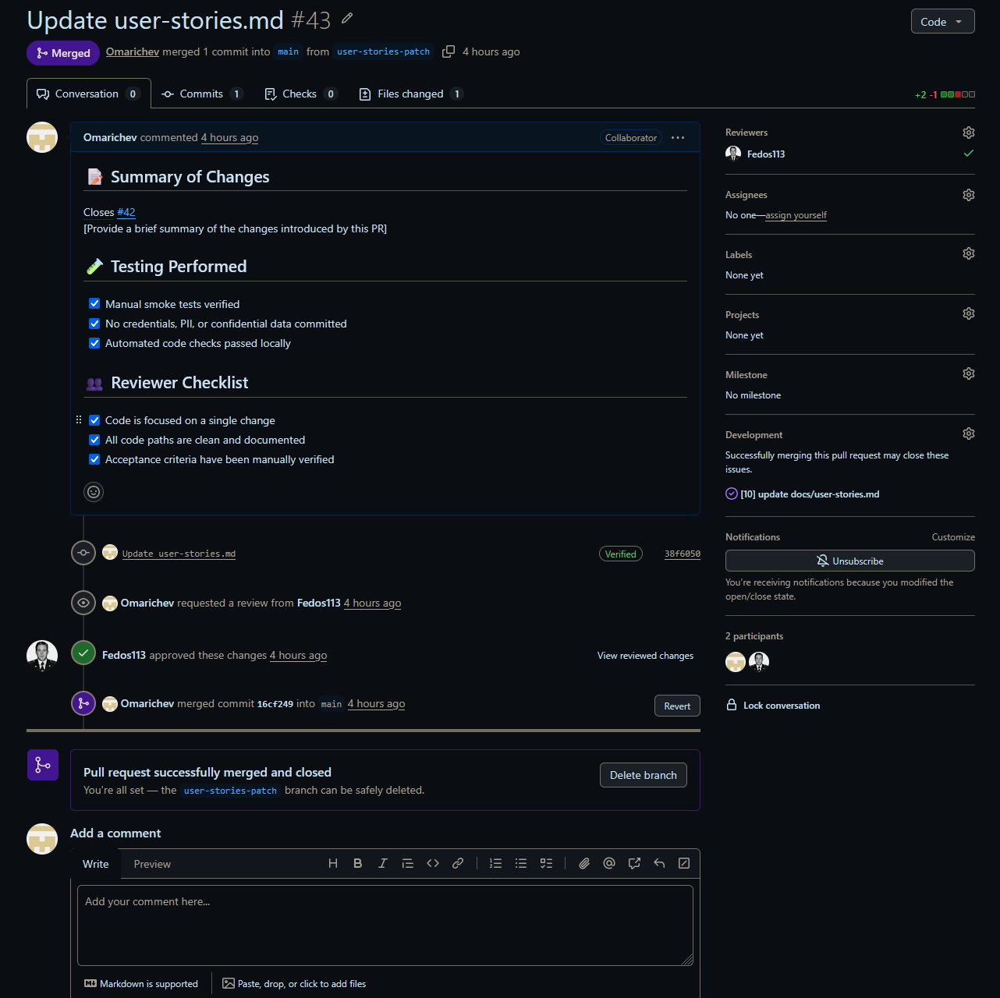

# SWP TickFrame — Week 3 Report (Assignment 3)

**Short Description:** FastAPI-based cryptocurrency chart workstation that fetches real-time market data from Bybit (with Binance fallback), streams it via WebSockets, and displays multi-panel candlestick charts using TradingView Lightweight Charts.

**License:** [MIT](../../LICENSE)

---

## 1. Scope and Backlog Summary

### User Stories and PBI Scope Evolution
Since Assignment 2, the user-story scope has expanded from the initial 5 MVP v0 stories (US-01 through US-05) to a full product backlog of **15 stories** covering pattern detection, multi-coin sidebar, timeframe selection, drawing tools, indicators (volume, RSI), Fear & Greed Index, theme toggle, and chart customization. The evolution includes:

- **US-06 to US-14** added to the backlog based on refined customer requirements.
- **US-15** (UI update) added during Sprint 2 to capture frontend work.
- MVP v0 scope (legacy `http.server` + threaded cache) fully replaced by MVP v1 (FastAPI + async cache + WebSocket streaming + Docker deployment).
- The `docs/user-stories.md` was restructured into a registry with MoSCoW priorities, issue links, and sprint assignments.
- **Current User Story Registry:** [docs/user-stories.md](../../docs/user-stories.md)
- **Historical Assignment 2 Stories:** [reports/week2/user-stories.md](../week2/user-stories.md)

### Addressing Assignment 2 Customer Feedback
The following customer feedback points from Assignment 2 were addressed during Week 3:

| Feedback | Action Taken | Evidence |
|---|---|---|
| Move to modern architecture | Migrated from `http.server` to FastAPI + Uvicorn + Docker | [PR #37](https://github.com/Fedos113/SWP_TickFrame_28_team/pull/37), [PR #39](https://github.com/Fedos113/SWP_TickFrame_28_team/pull/39), [PR #40](https://github.com/Fedos113/SWP_TickFrame_28_team/pull/40) |
| Real-time data updates | WebSocket candle/market streams with 5s polling | [PR #28](https://github.com/Fedos113/SWP_TickFrame_28_team/pull/28) |
| Theme toggle | US-13 scoped into Sprint 2 backlog | [Issue #16](https://github.com/Fedos113/SWP_TickFrame_28_team/issues/16) |
| Improved documentation | Restructured README, updated user-stories.md, added roadmap.md | [PR #34](https://github.com/Fedos113/SWP_TickFrame_28_team/pull/34), [PR #38](https://github.com/Fedos113/SWP_TickFrame_28_team/pull/38) |

### Backlog Metrics
- **Total Product Backlog Size:** 15 User Stories (story points not yet assigned — estimation process to be established in Sprint 2)
- **Total Current Sprint Size:** 2 PBIs planned for Sprint 2 (US-01: ML pattern detection, US-13: Theme toggle)

### Backlog & Sprint Boards
- **Product Backlog Board/View:** [GitHub Projects Board](https://github.com/users/Fedos113/projects/1/views/1)
- **Current Sprint Backlog Board/View:** [Sprint 2 View](https://github.com/users/Fedos113/projects/1/views/1)
- **Current Sprint Milestone:** [Sprint 2 Milestone](https://github.com/Fedos113/SWP_TickFrame_28_team/milestone/2)

---

## 2. MVP v1 Scope and Execution

### Selected MVP v1 Scope
MVP v1 delivers a production-ready architecture migration from the legacy MVP v0 (Python `http.server` + threaded cache) to a modern async stack:

- **FastAPI backend** with async Bybit v5 client and automatic Binance fallback
- **WebSocket streams** for real-time market prices and candle updates (5s polling)
- **In-memory cache** with 5-second TTL auto-refresh
- **TradingView Lightweight Charts** frontend with candlestick visualization
- **Docker Compose** deployment for one-command startup
- **CLI commands** (`scan`, `report`, `analyze`, `serve`) preserved for backward compatibility
- **MVP v1 Scope View:** [GitHub Projects MVP v1 Filter](https://github.com/users/Fedos113/projects/1/views/1)

### Workflow and Decomposition Approach
- **PBI Types, Statuses, and Priorities:** Managed through GitHub Issues with standard labels (Must Have, Should Have, Could Have) and tracked on the Projects board. Statuses flow: Backlog → To Do → In Progress → Done.
- **Sprint Milestone Usage:** The Sprint 2 milestone acts as the container for all PBIs selected for the current sprint cycle.
- **MVP Version Tracking:** MVP versions are tracked via milestone grouping and release tags (SemVer).
- **Task Decomposition:** User stories are decomposed into technical PBIs (e.g., US-13 "Theme toggle" → frontend implementation PRs). Larger epics like US-01 ("ML pattern detection") are split across sprints with mock implementation first, real model integration deferred.

### Verification Evidence
- **[PR #28 (MVPv1)](https://github.com/Fedos113/SWP_TickFrame_28_team/pull/28):** Core MVP v1 implementation — FastAPI backend, async Bybit client, WebSocket candle streaming, Lightweight Charts integration, CLI preservation.
- **[PR #30 (Customer Review)](https://github.com/Fedos113/SWP_TickFrame_28_team/pull/30):** Customer review transcript and summary artifacts.
- **[PR #34 (User Stories Docs)](https://github.com/Fedos113/SWP_TickFrame_28_team/pull/34):** User stories documentation update.
- **[PR #40 (README)](https://github.com/Fedos113/SWP_TickFrame_28_team/pull/40):** Docker-first README with VM-agnostic instructions.

---

## 3. Product Status and Roadmap

### Current Product Status
The MVP v1 is fully deployed and operational:

- **Live deployment:** [http://10.93.26.164:8000/](http://10.93.26.164:8000/)
- **REST API:** Health check, coin listing with live prices, candle data (up to 1000 candles) — all responding.
- **WebSocket streams:** Real-time market snapshot + candle updates every 5 seconds.
- **Frontend:** Interactive candlestick chart with dark/light theme toggle, coin sidebar with live price updates, analysis window markers (last 50 candles).
- **ML pattern detection:** Mock detector in place (Bull Flag, Head & Shoulders, etc. with randomized confidence). Real XGBoost integration is deferred.
- **CLI:** All four commands (`scan`, `report`, `analyze`, `serve`) functional.

### Next Steps and Roadmap Direction
- **Sprint 2 (current):** Deliver XGBoost-based ML pattern detection (US-01) and dark/light theme toggle (US-13).
- **Future sprints:** Multi-coin sidebar with 10 pairs (US-06), timeframe selector (US-07), drawing toolbar (US-08), volume/RSI sub-charts (US-10, US-11), Fear & Greed Index (US-12).
- **Full Roadmap:** [docs/roadmap.md](../../docs/roadmap.md)

---

## 4. Team Contributions

### Contribution Traceability

| Team Member | Role | Issues Created/Assigned | PRs/MRs Created | PRs/MRs Reviewed |
| :--- | :--- | :--- | :--- | :--- |
| Fedor Kozhevnikov | Product Owner | [#3](https://github.com/Fedos113/SWP_TickFrame_28_team/issues/3), [#8](https://github.com/Fedos113/SWP_TickFrame_28_team/issues/8) | [#20](https://github.com/Fedos113/SWP_TickFrame_28_team/pull/20), [#37](https://github.com/Fedos113/SWP_TickFrame_28_team/pull/37), [#39](https://github.com/Fedos113/SWP_TickFrame_28_team/pull/39), [#40](https://github.com/Fedos113/SWP_TickFrame_28_team/pull/40) | [#34](https://github.com/Fedos113/SWP_TickFrame_28_team/pull/34), [#43](https://github.com/Fedos113/SWP_TickFrame_28_team/pull/43) |
| Amir Gafarov | Developer (Backend / Data pipeline) | [#21](https://github.com/Fedos113/SWP_TickFrame_28_team/issues/21), [#24](https://github.com/Fedos113/SWP_TickFrame_28_team/issues/24), [#36](https://github.com/Fedos113/SWP_TickFrame_28_team/issues/36) | [#23](https://github.com/Fedos113/SWP_TickFrame_28_team/pull/23), [#25](https://github.com/Fedos113/SWP_TickFrame_28_team/pull/25), [#27](https://github.com/Fedos113/SWP_TickFrame_28_team/pull/27), [#43](https://github.com/Fedos113/SWP_TickFrame_28_team/pull/43) | [#51](https://github.com/Fedos113/SWP_TickFrame_28_team/pull/51) |
| Alan Mindubaev | Developer (Frontend / Backend) | [#50](https://github.com/Fedos113/SWP_TickFrame_28_team/issues/50) | [#30](https://github.com/Fedos113/SWP_TickFrame_28_team/pull/30) | [#28](https://github.com/Fedos113/SWP_TickFrame_28_team/pull/28) | 
| Mikhail Bezborodov | Developer (Frontend / UI) | [#5](https://github.com/Fedos113/SWP_TickFrame_28_team/issues/5), [#16](https://github.com/Fedos113/SWP_TickFrame_28_team/issues/16) | [#28](https://github.com/Fedos113/SWP_TickFrame_28_team/pull/28) | [#30](https://github.com/Fedos113/SWP_TickFrame_28_team/pull/30) |
| Daniil Zhechev | Scrum Master / ML Engineer | [#45](https://github.com/Fedos113/SWP_TickFrame_28_team/issues/45) | [#46](https://github.com/Fedos113/SWP_TickFrame_28_team/pull/46) | [#38](https://github.com/Fedos113/SWP_TickFrame_28_team/pull/38) |
---

## 5. Artifacts and Workflow Links

### Core Documentation
- [docs/roadmap.md](../../docs/roadmap.md)
- [docs/user-stories.md](../../docs/user-stories.md)
- [docs/definition-of-done.md](../../docs/definition-of-done.md)
- [CHANGELOG.md](../../CHANGELOG.md)

### Repository Workflow Templates
- **Issue Templates:** [.github/ISSUE_TEMPLATE/](../../.github/ISSUE_TEMPLATE/)
- **PR Template:** [.github/pull_request_template.md](../../.github/pull_request_template.md)

### Releases and Deployments
- **SemVer Release (MVP v1):** [v1.0.0 Release](https://github.com/Fedos113/SWP_TickFrame_28_team/releases/tag/SemVer-MVPv1)
- **Delivered MVP v1 Access:** [http://10.93.26.164:8000/](http://10.93.26.164:8000/)
- **Access/Run Instructions:** [Root README.md](../../README.md)
- **Video Demonstration:** Pending — see Section 8 of the Moodle submission report.

### Week 3 Reviewed PRs/MRs
- [PR #28: MVP v1 core implementation](https://github.com/Fedos113/SWP_TickFrame_28_team/pull/28)
- [PR #30: Week 3 customer review artifacts](https://github.com/Fedos113/SWP_TickFrame_28_team/pull/30)
- [PR #34: User stories documentation update](https://github.com/Fedos113/SWP_TickFrame_28_team/pull/34)
- [PR #37: README MVP v1 update](https://github.com/Fedos113/SWP_TickFrame_28_team/pull/37)
- [PR #38: Roadmap update](https://github.com/Fedos113/SWP_TickFrame_28_team/pull/38)
- [PR #39: README restructure](https://github.com/Fedos113/SWP_TickFrame_28_team/pull/39)
- [PR #40: Docker-first README](https://github.com/Fedos113/SWP_TickFrame_28_team/pull/40)
- [PR #43: User stories patch](https://github.com/Fedos113/SWP_TickFrame_28_team/pull/43)

---

## 6. Visual Evidence (Screenshots)

Screenshots should be placed in `reports/week3/images/`. Below are the required captures:

### Product and Sprint Backlogs
**Product Backlog View**

**Sprint Backlog View**

**Sprint Milestone**

### MVP and Release Evidence
**MVP Version Field / Grouped View**

**SemVer Release**

**Delivered MVP v1**

### Workflow Evidence
**Example Reviewed Issue-Linked PR/MR**

---

## 7. Customer Review and Reflections

The customer review meeting was held on **June 19, 2026** with the full team present. The customer reviewed the Figma design and the current MVP v1 increment.

- **Published Transcript:** [customer-review-transcript.md](customer-review-transcript.md)
- **Detailed Review Notes:** [customer-review-notes.md](customer-review-notes.md)
- **Customer Review Summary:** [customer-review-summary.md](customer-review-summary.md)

### Team Reflections and Retrospective
- **Week 3 Reflection:** [reflection.md](reflection.md)
- **Sprint Retrospective:** [retrospective.md](retrospective.md)
- **LLM Usage Report:** [llm-report.md](llm-report.md)
