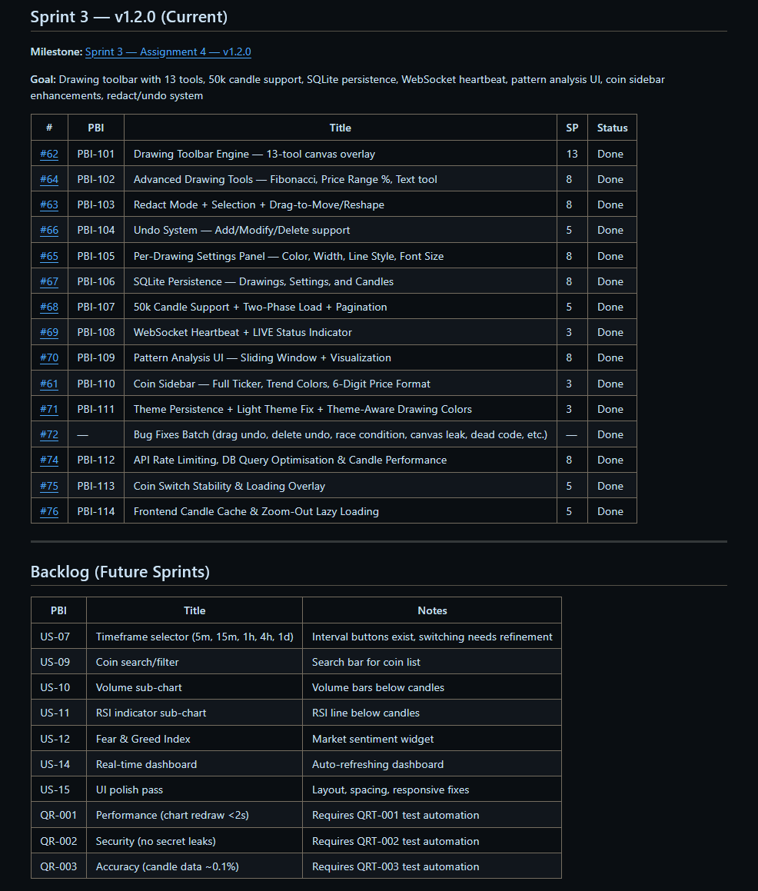
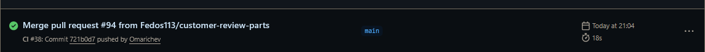
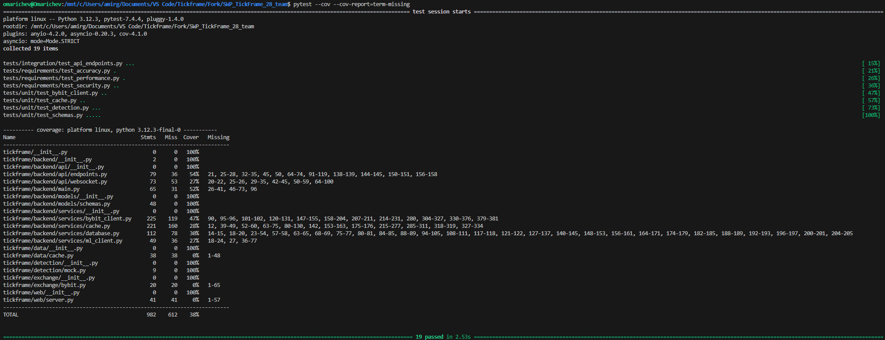
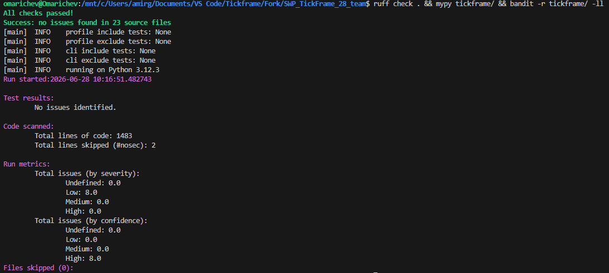
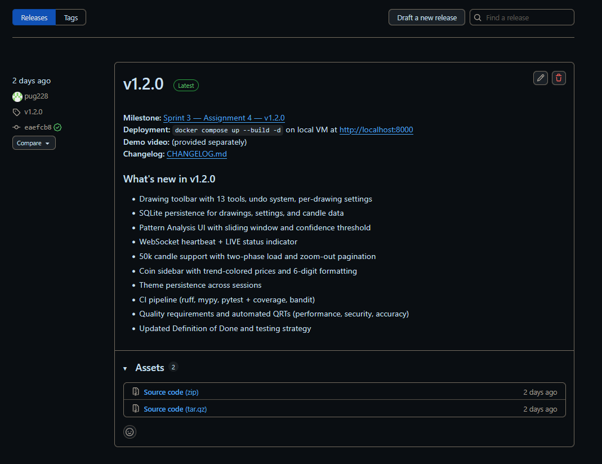
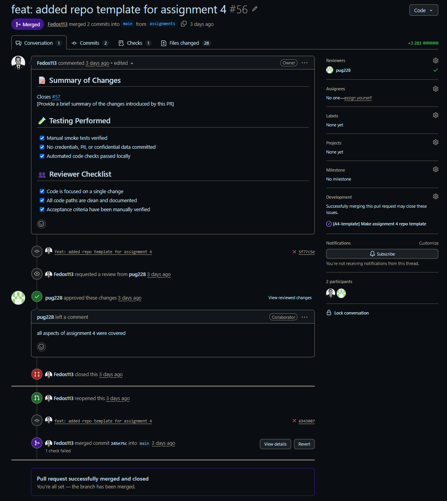

# Week 4 — Assignment 4 Report

> **Template** — Fill in every section below. Replace `[...]` with actual content.
>
> Instructions:
> - This is the **canonical Week 4 public report**
> - Must contain direct links to every applicable required file and external public artifact
> - Do NOT include private links (recordings, credentials, etc.) — those go in Moodle PDF
> - Every link must be a working permalink
> - See all 42 requirements in Assignment_04.md "Assignment Report in the Repository" section

---

## Project

**TickFrame** — open-source cryptocurrency chart pattern detection workstation.

**Team:** SWP_TickFrame_28
**Repository:** https://github.com/Fedos113/SWP_TickFrame_28_team
**Default branch:** `main`

---

## 1. Backlog and Sprint Planning

| Item | Link |
|---|---|
| Product Backlog board | https://github.com/Fedos113/SWP_TickFrame_28_team/issues |
| Sprint Backlog board | https://github.com/users/Fedos113/projects/1/views/1 |
| Assignment 4 Sprint milestone | https://github.com/Fedos113/SWP_TickFrame_28_team/milestone/3 |

- **Sprint Goal:** _[e.g., "Deliver a quality-gated increment with automated tests, CI, and UAT-ready product"]_
- **Sprint dates:** _[start date]_ → _[end date]_
- **Scope summary:** _[e.g., "3 quality requirements, 3 automated QRTs, unit + integration tests, CI pipeline, DoD update, and 2 backlog features"]_
- **Total Story Points:** _[number]_

---

## 2. Delivered Product Changes

_List key changes with PR links:_

- _[e.g., Added CI pipeline with linting, tests, and coverage — PR #XX]_
- _[e.g., Implemented timeframe selector (US-07) — PR #XX]_
- _[e.g., Updated Definition of Done for Assignment 4 — PR #XX]_

---

## 3. Deployed Product

- **URL:** _[deployment URL or "http://localhost:8000" for local-only]_
- **Run instructions:** [README.md](../../README.md)
- **Access method:** _[Docker, cloud link, etc.]_

---

## 4. Customer Feedback Response

| Feedback point | Resulting PBI | Status | Response |
|---|---|---|---|
| _[e.g., Customer could not find saved items]_ | [#XX](https://github.com/Fedos113/SWP_TickFrame_28_team/issues/XX) | Done | _[Response]_ |
| _[e.g., Customer requested more timeframes]_ | [#XX](https://github.com/Fedos113/SWP_TickFrame_28_team/issues/XX) | Not planned | _[Explanation]_ |

**Unaddressed feedback:** _[Explain any feedback not addressed with justification + linked backlog items]_

---

## 5. Documentation

| Document | Link |
|---|---|
| Roadmap | [docs/roadmap.md](../../docs/roadmap.md) |
| Definition of Done | [docs/definition-of-done.md](../../docs/definition-of-done.md) |
| Quality Requirements | [docs/quality-requirements.md](../../docs/quality-requirements.md) |
| Quality Requirement Tests | [docs/quality-requirement-tests.md](../../docs/quality-requirement-tests.md) |
| Testing Strategy | [docs/testing.md](../../docs/testing.md) |
| User Acceptance Tests | [docs/user-acceptance-tests.md](../../docs/user-acceptance-tests.md) |

---

## 6. Quality Model

_ISO/IEC 25010 sub-characteristics selected:_

| QR ID | Sub-characteristic | Brief scenario |
|---|---|---|
| QR-001 | Performance Efficiency — Time behaviour | Chart redraws within 2s under 10 concurrent users |
| QR-002 | Security — Confidentiality | API keys never leaked in logs or responses |
| QR-003 | Functional Suitability — Accuracy | Candle data within 0.1% of Bybit source |

---

## 7. Testing Status

**Critical module coverage:**

| Module | Coverage |
|---|---|
| `tickframe/backend/services/bybit_client.py` | _[XX]%_ |
| `tickframe/backend/services/cache.py` | _[XX]%_ |
| `tickframe/backend/api/endpoints.py` | _[XX]%_ |
| `tickframe/backend/api/websocket.py` | _[XX]%_ |
| `tickframe/detection/mock.py` | _[XX]%_ |
| `tickframe/backend/models/schemas.py` | _[XX]%_ |

**Global coverage:** _[XX]%_

| Test type | Location |
|---|---|
| Unit tests | [tests/unit/](../../tests/unit/) |
| Integration tests | [tests/integration/](../../tests/integration/) |
| Quality requirement tests | [tests/requirements/](../../tests/requirements/) |

---

## 8. CI Pipeline

| Item | Link |
|---|---|
| CI workflow configuration | [.github/workflows/ci.yml](../../.github/workflows/ci.yml) |
| Lychee link checker | [.github/workflows/lychee.yml](../../.github/workflows/lychee.yml) |
| Latest passing run on `main` | _[GitHub Actions run URL]_ |

**Branch protection:** Enabled on `main` — see screenshot below.

---

## 9. Screenshots

| Screenshot | Image |
|---|---|
| Sprint 3 milestone |  |
| Latest CI run (passing) |  |
| Branch protection rules |  |
| Coverage report |  |
| Additional QA check result |  |
| SemVer release (v0.2.0) |  |
| Example reviewed PR |  |

_Optional additional screenshots: Product Backlog board, Sprint Backlog board, deployed product view._

---

## 10. Quality Gates Continuity

_Explain how the Assignment 4 tests, CI checks, QRTs, and DoD continue to govern later project work:_

- _[e.g., "Tests are maintained product assets. The CI pipeline runs on every PR to main.
   The DoD requires all CI checks to pass before merge. Future PBIs may not bypass
   these gates without documented TA-approved exceptions."]_

---

## 11. Release

| Item | Link |
|---|---|
| SemVer release v0.2.0 | https://github.com/Fedos113/SWP_TickFrame_28_team/releases/tag/v0.2.0 |
| CHANGELOG | [CHANGELOG.md](../../CHANGELOG.md) |
| Public sanitized demo video | _[YouTube/Drive link — < 2 min]_ |

---

## 12. UAT Results

| Scenario | Result | Notes |
|---|---|---|
| UAT-001 — Scan and view chart patterns | ✅ Pass | _[Notes]_ |
| UAT-002 — Toggle timeframes | ❌ Fail | _[e.g., 1h option not available]_ |
| UAT-003 — Export scan results | ✅ Pass | _[Notes]_ |
| UAT-004 — Real-time sidebar | ✅ Pass | _[Notes]_ |
| UAT-005 — Theme toggle | ✅ Pass | _[Notes]_ |

**Key feedback:**
- _[Feedback point 1]_
- _[Feedback point 2]_

**Resulting PBIs:** _[Links to new issues created from UAT feedback]_

---

## 13. Customer Review

| Item | Status |
|---|---|
| Transcript | [customer-review-transcript.md](customer-review-transcript.md) — OR — *Shared only via Moodle (publication refused)* |
| Notes | [customer-review-notes.md](customer-review-notes.md) — *(if recording/sharing refused)* |
| Summary | [customer-review-summary.md](customer-review-summary.md) |

---

## 14. Sprint Retrospective

[reports/week4/retrospective.md](retrospective.md)

---

## 15. Reflection

[reports/week4/reflection.md](reflection.md)

---

## 16. LLM Report

[reports/week4/llm-report.md](llm-report.md)

---

## 17. Current Product Status

_[Summary: e.g., "TickFrame v0.2.0 is deployed with a fully automated CI pipeline,
3 quality requirements with automated QRTs, and unit/integration tests achieving
≥30% coverage on critical modules. Two new product features were added: timeframe
selector and real-time sidebar. Customer UAT confirmed 4/5 scenarios passing."]_

---

## 18. Next Steps

_[Summary: e.g., "The next Sprint will focus on remaining backlog features: RSI chart
(US-11), volume chart (US-10), and drawing tools (US-08). Quality gates established
in this Sprint will continue to apply."]_

---

## 19. Contribution Traceability

| Team member | Issues | PRs | Reviews | Testing | QA | Docs |
|---|---|---|---|---|---|---|
| _[@user1]_ | _[#X, #Y]_ | _[#Z]_ | _[#W]_ | _[tests/...]_ | _[CI config]_ | _[docs/...]_ |
| _[@user2]_ | _[...]_ | _[...]_ | _[...]_ | _[...]_ | _[...]_ | _[...]_ |
| _[@user3]_ | _[...]_ | _[...]_ | _[...]_ | _[...]_ | _[...]_ | _[...]_ |
| _[@user4]_ | _[...]_ | _[...]_ | _[...]_ | _[...]_ | _[...]_ | _[...]_ |

---

## 20. Presentation

- **Public slides (optional):** [reports/week4/presentation.pdf](presentation.pdf)
- **Moodle slides:** Submitted via dedicated Moodle slide submission
- **Rehearsed presentation video:** Submitted via Moodle PDF

---

> **Verification checklist:**
> - [ ] All links work (test each one)
> - [ ] Screenshots are present in `images/` directory
> - [ ] No private info committed (recordings, credentials, PII)
> - [ ] Every required item from Assignment_04.md is covered
